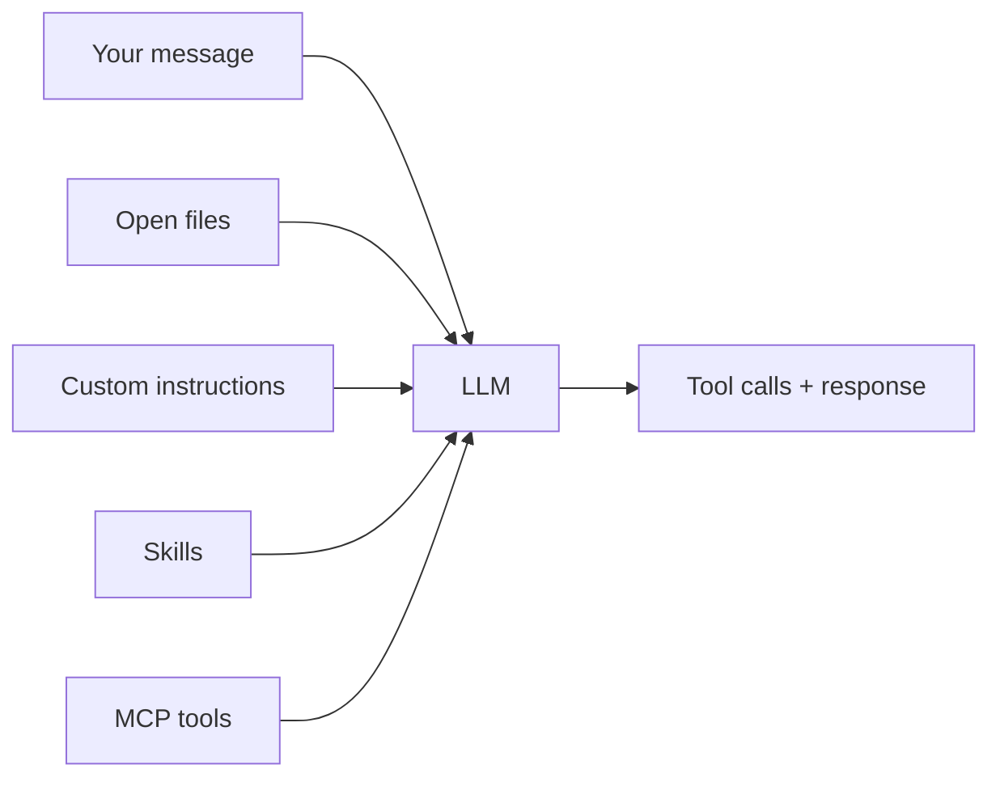
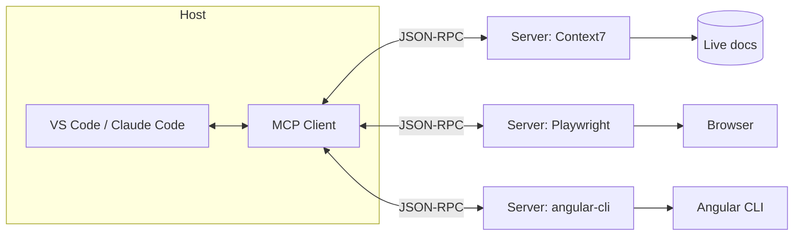

# Module 1

Context Management — the foundation

---
layout: default
---

# Context Beats Cleverness

> "The model is only as good as the context you give it."

A great prompt against a blind model loses to an average prompt against a well-briefed one.

The single biggest quality lever — bigger than picking the right model.

---
layout: default
---

# How the Model Sees Your Repo

<div style="display: flex; justify-content: center; margin-top: 8px;">



</div>

Everything left of the model is **context** — and it's the part you control.

---
layout: default
---

# The Three Layers of Context

- **Custom Instructions** — always-on rules, injected every turn
- **Skills** — on-demand capability bundles, loaded when relevant
- **MCP** — live tools and data from the outside world

<br>

Each layer has a different cost, a different scope, and a different use case.

We'll walk through all three.

---
layout: section
---

# Layer 1

Custom Instructions

---
layout: default
---

# Custom Instructions — The Idea

- Markdown files that travel with the repo
- Auto-injected into every chat request
- Scoped: user, project, or file pattern
- Versioned in git → the whole team benefits

<br>

Stop re-explaining your stack every conversation.

---
layout: default
---

# Repo-Wide: `.github/copilot-instructions.md`

```markdown
# Project Conventions

This is an Angular 21 + NgRx Signal Store project.

- Standalone components only — never `NgModule`
- Signals over RxJS where possible
- State lives in `*-store.ts` files
- Vitest for unit tests, Playwright for E2E
- Never use pnpm or yarn — always npm
```

Auto-applied to **every** Copilot Chat request in this repo.

---
layout: default
---

# Scoped: `.github/instructions/*.instructions.md`

```markdown
---
description: 'NgRx Signals Store v21+ patterns'
applyTo: '**/*-store.ts'
---

- Use `signalStore({ providedIn: 'root' })`
- Compose with `withState`, `withEntities`, `withMethods`
- Use `rxMethod` for Observables, `signalMethod` for signals
- State updates only via `patchState` — never mutate directly
```

The `applyTo` glob means this file **only** loads when the chat context touches `*-store.ts`. Context stays focused.

---
layout: default
---

# Multiple Scoped Files in the Demo

```
.github/
├── copilot-instructions.md            # repo-wide baseline
└── instructions/
    ├── angular.instructions.md         # **/*.ts, **/*.html
    ├── angular-material.instructions.md # **/*-component.ts
    ├── angular-testing.instructions.md  # **/*.spec.ts
    ├── ngrx-signals.instructions.md     # **/*-store.ts
    ├── ngrx-signals-testing.instructions.md
    ├── architecture.instructions.md     # **/*.ts
    └── typescript.instructions.md       # **/*.ts
```

One concern per file. Each loads only when needed.

---
layout: default
---

# Let Copilot Scaffold It · `/create-instruction`

VS Code Copilot Chat ships slash commands that **write these files for you**:

```text
/init                 → repo-wide .github/copilot-instructions.md
/create-instruction   → scoped .github/instructions/<name>.instructions.md
/instructions         → menu: pick existing or create new
```

Typical flow:

1. Type `/create-instruction` in Chat
2. Describe the rule — e.g. _"Vitest spec files in `**/*.spec.ts` must use `describe` + `it`, no `test()`"_
3. Copilot asks clarifying questions, picks the right `applyTo` glob
4. File is generated, ready to commit

<br>

→ Same idea for prompts (`/create-prompt`) and agents (`/create-agent`) — covered in M3.

---
layout: default
---

# `AGENTS.md` — The Universal Convention

- Plain markdown, one file at repo root
- Read by Copilot, Claude Code, Cursor, Codex, Aider, …
- Stack, commands, conventions, architecture
- One source of truth for all assistants

<br>

The closest thing the industry has to a standard right now.

---
layout: default
---

# Real `AGENTS.md` Example

```markdown
# AGENTS.md

## Commands

- `npm start` — dev server + json-server mock API
- `npm test` — unit tests (Vitest)
- `npm run test:e2e` — Playwright E2E
- Always use **npm**, never pnpm/yarn

## Stack

- Angular 21, NgRx Signal Store 21, Material 3
- TypeScript 5.9 strict mode, no `any`

## Architecture (DDD)

Each domain under `src/app/features/<domain>/`:

- `feature/` — smart containers (route-level)
- `ui/` — presentational components (OnPush)
- `data/` — `models/`, `infrastructure/`, `state/`
- `util/` — pure helpers
```

Lean, factual, no fluff. The AI reads it like a contract.

---
layout: two-cols
---

# Three Scopes

**Personal**

- Your editor settings
- Your style preferences
- Not committed to the repo

**Project**

- Repo-wide rules
- `.github/copilot-instructions.md`
- `AGENTS.md`

::right::

# &nbsp;

**File-scoped**

- Domain-specific rules
- `applyTo` glob in `.github/instructions/`
- Loads only when matching files are in context

<br>

→ Layer them. Don't dump everything into one file.

---
layout: default
---

# `applyTo` Glob Cookbook

```yaml
applyTo: '**/*.ts'              # all TypeScript
applyTo: '**/*-store.ts'        # only NgRx Signal Stores
applyTo: '**/*.spec.ts'         # only test files
applyTo: 'src/app/features/**'  # only feature code
applyTo: '**/*.ts, **/*.html'   # multiple patterns
```

The agent loads the file only when at least one open/referenced file matches.

---
layout: default
---

# Anti-Patterns

- One 500-line `copilot-instructions.md` no one reads
- Rules contradicting each other across files
- Rules that no longer match the code (rot)
- Instructions describing _what_ without _why_
- "Always be polite" — wastes tokens, changes nothing

<br>

Treat instruction files like code: review, refactor, delete what's dead.

---
layout: two-cols
---

# Copilot

- `.github/copilot-instructions.md`
- `.github/instructions/*.instructions.md`
- `AGENTS.md` (also supported)

::right::

# Claude Code

- `CLAUDE.md` at repo root
- `AGENTS.md` (also supported)
- `~/.claude/` for personal memory
- `.claude/settings.json` for permissions

<br>

Same patterns. Different file conventions.

---
layout: default
---

# 🛠 Hands-on 1a · Custom Instructions · 10 min

## Scaffold repo-aware rules with `/init`

1. Open `copilot-workflow-demo` (or your own repo)
2. **Scaffold a baseline** with the harness you picked:
   - **Copilot CLI:** `copilot` → `/init`
   - **Claude Code:** `claude` → `/init`
   - **VS Code Copilot Chat:** `/init`
3. Review the generated file — delete the fluff, sharpen 2–3 rules
4. **Add a scoped file** under `.github/instructions/` with an `applyTo` glob:
   - **VS Code Copilot Chat:** `/create-instruction` → describe the rule, let Copilot pick the glob
5. Ask the same question **before and after** — note the difference

---
layout: section
---

# Layer 2

Skills

---
layout: default
---

# What Is a Skill?

A **packaged capability** the agent can load on demand.

- A folder, not a single file
- Contains a `SKILL.md` plus optional scripts, references, examples
- The model decides _when_ to load it — based on the description
- Portable across projects and across tools

<br>

Think of it as a small playbook your AI carries with it.

---
layout: default
---

# Skills vs Instructions vs MCP

|                    | Instructions            | Skills                 | MCP                 |
| ------------------ | ----------------------- | ---------------------- | ------------------- |
| **Loading**        | Always injected         | On-demand by model     | Live tool calls     |
| **Cost**           | Pays every turn         | Pays only when used    | Pays per call       |
| **Content**        | Rules & conventions     | Step-by-step playbooks | Live data & actions |
| **Where it lives** | `.github/instructions/` | Folder per skill       | A running server    |
| **Best for**       | "Always do X"           | "When asked Y, do Z"   | "Talk to system A"  |

<br>

These three are complements, not alternatives.

---
layout: default
---

# Skills Are Folders, Not Files

```
.claude/skills/code-review/
├── SKILL.md              # the entry point
├── checklist.md          # reference doc
├── examples/
│   ├── good-pr.md
│   └── bad-pr.md
└── scripts/
    └── run-eslint.sh
```

The model reads `SKILL.md` first. Other files are referenced from there.

This is why skills can be much more than a prompt template.

---
layout: default
---

# `SKILL.md` Anatomy

```markdown
---
name: code-review
description: |
  Review a PR diff for correctness, style, security, and tests.
  Use when the user asks for a code review or PR review.
allowed-tools: ['read/*', 'execute/runInTerminal', 'eslint/*']
---

# Code Review Playbook

## 1. Gather context

- Read changed files with `read/readFile`
- Check existing tests with `search/usages`

## 2. Review dimensions

- Correctness — does it do what the PR claims?
- Style — matches `.github/instructions/`?
- Security — input validation, secrets, authz?
- Tests — coverage proportional to risk?

## 3. Output format

- Summary (2-3 sentences)
- Issues grouped by severity
- Concrete suggestions, not just complaints
```

---
layout: default
---

# Frontmatter Fields

| Field                      | Purpose                                                |
| -------------------------- | ------------------------------------------------------ |
| `name`                     | Identifier — shown in slash menu                       |
| `description`              | What the skill does + **when** the model should use it |
| `allowed-tools`            | Restrict to specific tools / patterns                  |
| `disable-model-invocation` | If `true`, only user can trigger via slash             |
| `model`                    | Override model (e.g. `opus` for hard reviews)          |
| `argument-hint`            | Hint shown when user invokes with `/skill-name`        |

The `description` is the most important field — it tells the model when to load this skill.

---
layout: default
---

# Description: The Critical Field

```yaml
# ❌ Weak
description: 'Code review'

# ❌ Vague
description: 'Reviews things'

# ✅ Strong
description: |
  Review a PR diff for correctness, style, security, and tests.
  Use when the user asks for a code review, PR review, or
  "review this change".
```

The model scans descriptions to pick which skill to load. A weak description = a skill that never runs.

---
layout: default
---

# Skills With Scripts

A skill can ship **executable helpers**, not just markdown:

```
.claude/skills/run-tests/
├── SKILL.md              # "When the user wants to run tests…"
└── scripts/
    └── test-runner.sh    # filters, retries flaky tests
```

`SKILL.md` tells the agent _when_ and _how_ to call the script.

Better than asking the model to remember the exact command.

---
layout: default
---

# Skill Lifecycle

1. **Discovery** — agent scans skill folders at session start
2. **Indexing** — descriptions are added to the system prompt
3. **Selection** — model picks a skill when the user's request matches
4. **Loading** — full `SKILL.md` (+ referenced files) is read in
5. **Execution** — agent follows the playbook

<br>

Only step 5 costs full tokens. Steps 1–3 are cheap.

---
layout: default
---

# Skill Precedence

When multiple skills could match:

- **Enterprise** skills win over **Personal** skills
- **Personal** skills win over **Project** skills
- **Plugin** skills live under a `plugin:skill-name` namespace — no collisions

Force a specific one: `> use the security-scan skill on src/auth.ts`

---
layout: section
---

# skills.sh

The open ecosystem for skills

---
layout: default
---

# Why `skills.sh`?

- A package manager for AI skills
- One command installs the same skill for all your agents
- Supports 43+ agents: Copilot, Claude Code, Cursor, Codex, Cline, …
- Lock file (`skills-lock.json`) pins versions like `package-lock.json`

<br>

Open source: `github.com/vercel-labs/skills`

---
layout: default
---

# Install Skills

```bash
# install all skills from a GitHub repo
npx skills add vercel-labs/agent-skills

# install one specific skill from that repo
npx skills add owner/repo --skill playwright

# install for one agent only
npx skills add owner/repo -a github-copilot

# install globally — available across all your projects
npx skills add owner/repo --global
```

One command. Multiple agents. Project- or user-scope.

---
layout: default
---

# Manage Installed Skills

```bash
npx skills list              # show installed skills
npx skills find typescript   # search the registry
npx skills check             # check for updates
npx skills update            # update all skills
npx skills remove playwright # uninstall one
```

Same mental model as `npm` — but for AI capabilities.

---
layout: default
---

# Project vs Global Scope

| Scope       | Location                  | Distribution                            |
| ----------- | ------------------------- | --------------------------------------- |
| **Project** | `.agents/skills/`         | Committed to git → `git pull` shares it |
| **Global**  | `~/.copilot/skills/` etc. | Your machine only                       |

```bash
npx skills add owner/repo        # → project (default)
npx skills add owner/repo -g     # → global
```

Project-scope + git = zero-config team sharing.

---
layout: default
---

# Team Distribution Workflow

1. Create `your-org/team-skills` on GitHub
2. Add skills: PR conventions, API guidelines, release notes
3. Team installs once: `npx skills add your-org/team-skills`
4. Update via PR → teammates run `npx skills update`
5. Or commit project-local skills → shared via `git pull` automatically

<br>

A new hire's first day:

```bash
git clone team/repo && cd repo && npm install && npx skills update
```

---
layout: default
---

# Scaffolding a New Skill

```bash
npx skills init pr-conventions
```

Creates:

```
pr-conventions/
├── SKILL.md           # frontmatter + body template
├── README.md
└── examples/
```

Fill in the description, write the playbook, commit, push.

Low barrier to encoding team knowledge as a skill.

---
layout: default
---

# Popular Skills to Try First

- **context7** — live, version-accurate library docs
- **playwright-cli** — browser automation playbook
- **pdf** — read, merge, split, OCR PDFs
- **pptx** — generate and edit PowerPoint decks
- **slidev** — author Slidev presentations
- **skill-creator** — a skill that creates skills

<br>

Browse: `skills.sh`

---
layout: two-cols
---

# Skills work well when…

- The task recurs week after week
- The workflow has clear steps
- The output is text + maybe a script
- You want zero auth / no external service

::right::

# Skills are the wrong tool when…

- You need live data from a system (use MCP)
- You need OAuth to a third-party (use MCP)
- It's a one-off task (just prompt directly)

<br>

Skills = team-specific knowledge. MCP = external systems.

---
layout: default
---

# 🛠 Hands-on 1b · Skills · 10 min

## Install a skill, then run it

1. Install one skill into your repo:

   ```bash
   npx skills add vercel-labs/agent-skills --skill context7
   ```

2. Verify: `npx skills list`
3. Ask the agent a **library-version question** (e.g. _"How does Angular 21's `resource()` API work?"_) — observe how the skill loads
4. **Bonus:** scaffold your own with `npx skills init my-team-rules`, write a sharp `description`, commit, push

---
layout: section
---

# Layer 3

Model Context Protocol (MCP)

---
layout: default
---

# The N × M Problem

Without a standard:

- N AI tools × M data sources = N × M custom integrations
- Every vendor reinvents the same connectors
- A new IDE means re-doing every plugin

<br>

MCP turns N × M into **N + M**.

---
layout: default
---

# What Is MCP?

The **Model Context Protocol** — an open standard for connecting AI clients to tools and data sources.

- Open spec at `modelcontextprotocol.io`
- JSON-RPC 2.0 under the hood
- One server, many clients

<br>

"USB-C for AI" — one connector, every device.

---
layout: default
---

# MCP Architecture

<div style="display: flex; justify-content: center; margin-top: 8px;">



</div>

Host = your IDE. Client = built-in. Servers = pluggable.

---
layout: default
---

# How LLMs Actually Use Tools

```text
1. Host sends: "Here are tools — read_file, edit_file, ..."
2. User:  "Read index.ts and fix the off-by-one bug"
3. Model: {"tool": "read_file", "args": {"path": "index.ts"}}
4. Host runs the tool, returns content
5. Model: {"tool": "edit_file", "args": {"changes": [...]}}
6. Host applies the edit, returns result
7. Loop until the model says it's done
```

The model never touches your filesystem. The **host** does — on the model's request.

---
layout: default
---

# The Three MCP Primitives

|                   | Tools                       | Resources              | Prompts              |
| ----------------- | --------------------------- | ---------------------- | -------------------- |
| **Icon**          | 🔧                          | 📄                     | 💬                   |
| **Purpose**       | Functions the AI can invoke | Data the AI can read   | Reusable templates   |
| **Examples**      | run a query, exec shell     | file contents, schemas | code-review template |
| **Controlled by** | Model                       | Application            | User                 |

Most MCP servers ship all three.

---
layout: default
---

# Primitive 1 · Tools (model-controlled)

The AI decides _when_ to call a tool.

Examples from Playwright MCP:

```json
{
  "name": "browser_navigate",
  "description": "Navigate to a URL in the browser",
  "inputSchema": { "type": "object", "properties": { "url": { "type": "string" } } }
}
```

Tools have typed schemas. The model fills them in like calling a function.

---
layout: default
---

# Primitive 2 · Resources (app-controlled)

The host exposes data the AI can read.

- A live database schema
- An API documentation page
- Current Jira ticket
- A file outside the workspace

The user (or host) decides what's exposed. The model reads when relevant.

---
layout: default
---

# Primitive 3 · Prompts (user-controlled)

Reusable templates the user explicitly invokes.

```
/playwright-test-template

Generates a Playwright BDD scenario for the
currently open component.
```

User picks them from a slash menu — they aren't auto-triggered by the model.

---
layout: default
---

# Transport: stdio vs HTTP

|              | stdio                          | Streamable HTTP              |
| ------------ | ------------------------------ | ---------------------------- |
| **How**      | Server runs as child process   | Server runs as HTTP service  |
| **Use case** | Local tools (CLI, file system) | Remote APIs, OAuth-protected |
| **Latency**  | Tiny                           | Network roundtrip            |
| **Auth**     | Process-level                  | OAuth, API keys              |

Most local MCP servers use stdio. Hosted ones (Context7, GitHub) use HTTP.

---
layout: default
---

# Where to Put `.mcp.json`

| Client      | File path                                       |
| ----------- | ----------------------------------------------- |
| Copilot     | `.vscode/mcp.json` _or_ `.mcp.json`             |
| Claude Code | `.mcp.json` (project) + `~/.claude.json` (user) |
| Cursor      | `.cursor/mcp.json`                              |

**Same server. Same JSON. Different file paths.** This is the whole point of MCP.

---
layout: default
---

# `.mcp.json` From the Demo Repo

```json
{
  "mcpServers": {
    "context7": { "type": "http", "url": "https://mcp.context7.com/mcp/oauth" },
    "angular-cli": { "command": "npx", "args": ["-y", "@angular/cli", "mcp"] },
    "playwright-test": { "command": "npx", "args": ["playwright", "run-test-mcp-server"] },
    "eslint": { "command": "npx", "args": ["@eslint/mcp@latest"] }
  }
}
```

Three local servers (stdio via `npx`), one hosted (HTTP). Drop the file in, restart the editor.

---
layout: section
---

# Three MCP Servers Worth Knowing

---
layout: default
---

# Example 1 · Context7 MCP

**Problem it solves:** your model's training data is months old. Angular 21 didn't exist when it was trained.

**What it provides:**

- Live, version-accurate documentation for thousands of libraries
- Tools: `resolve-library-id`, `query-docs`
- Hosted as HTTP — zero local setup

```json
"context7": { "type": "http", "url": "https://mcp.context7.com/mcp/oauth" }
```

---
layout: default
---

# Context7 in Action

```
You: How do I use Angular's new resource() API?
```

Without Context7 → model invents an API that doesn't exist.

```
You: Same question + Context7 enabled
```

Model calls `resolve-library-id("angular")` → `query-docs("resource API")` → returns current docs → answer is correct and version-matched.

The cure for "hallucinated API" answers.

---
layout: default
---

# Example 2 · Playwright MCP

**Problem it solves:** the model needs to _see_ the running app to fix UI bugs.

**What it provides:**

- A real browser the agent can drive
- Tools: `browser_navigate`, `browser_click`, `browser_snapshot`, `browser_evaluate`, `browser_console_messages`
- Stdio, runs locally as a child process

```json
"playwright": { "command": "npx", "args": ["@playwright/mcp@latest"] }
```

---
layout: default
---

# Playwright MCP in Action

```
You: The login button isn't working. Fix it.
```

The agent can now:

1. `browser_navigate` → opens the app
2. `browser_click` → clicks login
3. `browser_console_messages` → reads the error
4. `browser_snapshot` → sees the DOM
5. Reads your source, finds the bug, fixes it
6. Verifies the fix in the browser

End-to-end debugging without you switching windows.

---
layout: default
---

# Example 3 · Angular CLI MCP

**Problem it solves:** the model knows Angular generally, but not _your_ workspace's exact schematics.

**What it provides:**

- Tools wired to your local `@angular/cli`
- `ng generate` with the right flags
- Workspace-aware: knows your `angular.json` configuration

```json
"angular-cli": { "command": "npx", "args": ["-y", "@angular/cli", "mcp"] }
```

---
layout: default
---

# Angular CLI MCP in Action

```
You: Add a new feature called "tags" with a store, an API
service, and a smart component.
```

The agent can now:

1. Call the Angular CLI MCP tool: `ng generate component features/tags`
2. Use real schematics, real defaults, real file layout
3. Skip the "I'll just write the file" guesswork
4. Output matches your team's conventions automatically

---
layout: default
---

# Other MCPs Worth Setting Up

- **github** — issues, PRs, releases
- **postgres** / **sqlite** — query your DB schema and data
- **filesystem** — explicit, sandboxed file access
- **linear** / **jira** — your team's tickets
- **slack** — channel context for incident response
- **eslint** — feedback loop for "fix every lint error"

Catalog: `modelcontextprotocol.io/servers`

---
layout: default
---

# MCP Inspector — Debug Your Servers

```bash
npx @modelcontextprotocol/inspector
# → opens at http://localhost:6274
```

In the UI:

1. Connect to your MCP server
2. Browse all tools, resources, prompts
3. Call any tool, inspect raw JSON-RPC responses
4. Watch logs in real time

Essential when something doesn't work in your IDE — you want to know if it's the server or the client.

---
layout: default
---

# Sandboxing & Security

- Every MCP server is **code you didn't write**, running on your machine
- It can read files, run shell commands, talk to the internet
- Treat it like an npm dependency: review before installing

Hardening:

- VS Code: `mcp.sandboxEnabled: true` in `.vscode/mcp.json`
- Don't expose secrets in env vars unless the server needs them
- Pin versions (`@playwright/mcp@1.42.0`), don't blindly `@latest`

---
layout: default
---

# Decision Framework: Skills, MCP, or CLI?

| If you need…                          | Use…                   |
| ------------------------------------- | ---------------------- |
| Local tools (git, docker, npm)        | **CLI** in a script    |
| Remote APIs with OAuth (Jira, GitHub) | **MCP**                |
| Live data from a running system       | **MCP**                |
| Team-specific workflow knowledge      | **Skill**              |
| Pure domain knowledge, no scripts     | **Skill**              |
| CLI + guidance bundled                | **Skill wrapping CLI** |

<br>

Rule of thumb: Private/bespoke → Skill. Public/vendor → MCP. Local exec → CLI.

---
layout: two-cols
---

# Copilot

- `.github/instructions/*.instructions.md`
- `.github/agents/` (with allowed-tools)
- `.vscode/mcp.json` or `.mcp.json`
- Skills via `skills.sh`

::right::

# Claude Code

- `CLAUDE.md`, `AGENTS.md`
- `.claude/skills/<name>/SKILL.md` natively
- `.mcp.json` (same format)
- Built-in skills (pdf, pptx, docx)

<br>

Same three layers. Different file conventions.

---
layout: default
---

# 🛠 Hands-on 1c · MCP · 10 min

## Wire up one server, watch the agent call it

1. Open `.mcp.json` from the demo repo (or create one at the project root)
2. Add **one** server — pick what fits your task:
   - **Context7** (HTTP, hosted) — for live library docs
   - **Playwright** (stdio, local) — for browser-driven debugging
3. Restart the editor / `copilot` CLI so the server registers
4. **Inspect:** `npx @modelcontextprotocol/inspector` → connect, list tools, call one
5. Ask a question that _needs_ the tool — confirm the agent invokes it (don't just take its word)
