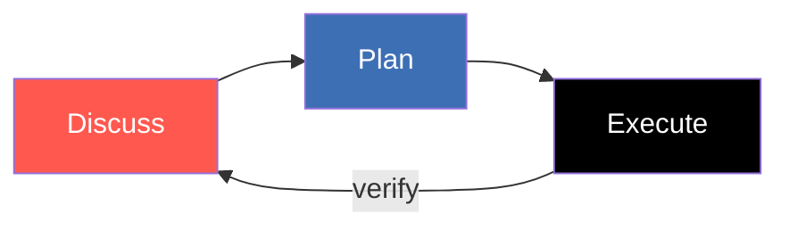

# Module 2

Prompting — from chat to outcome

---
layout: default
---

# The Three-Step Loop

- **Discuss** — clarify intent before any code
- **Plan** — write the approach down, review, edit
- **Execute** — small steps, verify each

<br>

Skipping a step is the most common failure mode.

The loop is fractal — it repeats inside every task, and inside every sub-task.

---
layout: default
---

# Discuss → Plan → Execute

<div style="display: flex; justify-content: center; margin-top: 32px;">



</div>

---
layout: default
---

# Step 1 · Discuss

- Ask the model questions before giving instructions
- Surface unknowns: edge cases, naming, file location
- The model becomes a thinking partner, not a typist
- Output: a shared understanding of _what_ you want

<br>

In Copilot: **Ask mode**. In Claude Code: read-only chat (before plan mode).

---
layout: default
---

# Discuss — What to Ask

- "Where in the codebase would this feature live?"
- "What existing utility could I reuse?"
- "What edge cases am I missing?"
- "How is similar functionality tested today?"
- "What would you call this — and why?"

<br>

Treat the AI like a senior colleague who just joined the team.

---
layout: default
---

# Step 2 · Plan

- Ask for a **written plan** — files, steps, tests
- Read it. Push back. Edit it.
- If the plan is wrong, the code will be wrong
- Output: an artefact you can review in 60 seconds

<br>

In Copilot: **Plan mode** (read-only). In Claude Code: `Shift+Tab` → plan mode.

---
layout: default
---

# What a Good Plan Looks Like

```markdown
## Plan: Add `tags: string[]` to Task

### Files to change

1. src/app/features/tasks/data/models/task.model.ts — add field
2. src/app/features/tasks/data/state/task-store.ts — handle in patch
3. src/app/features/tasks/ui/task-card.html — render chips
4. src/app/features/tasks/data/state/task-store.spec.ts — new test

### Steps

1. Update Task interface (optional field for backwards compat)
2. Update store update method to accept tags
3. Render in card with Material chips
4. Add unit test for tag patching

### Out of scope

- Filtering by tag (separate feature)
```

Reviewable in 60 seconds. That's the whole point.

---
layout: default
---

# Step 3 · Execute

- Hand the plan to an agent
- Small commits, verify each step
- `npm test`, `npm run lint`, look at the diff
- Output: working code you understand

<br>

In Copilot: **Agent mode**. In Claude Code: Auto mode (or step-by-step).

---
layout: default
---

# The Most Common Failure

Skipping straight to Execute.

```text
"Add a tags field to tasks"
   → model invents schema
   → model picks wrong file layout
   → model breaks an existing test
   → you debug for 30 minutes
```

<br>

A 2-minute Discuss + Plan saves the 30 minutes downstream.

---
layout: two-cols
---

# ✅ Do

- Use `@file:path/to/file` to scope context
- `/clear` between unrelated tasks
- `/compact` proactively at ~60% context
- Plan first on anything touching prod
- Small commits — easy to undo

::right::

# ❌ Don't

- Paste 5,000-line files into chat
- Mix two unrelated tasks in one session
- Skip plan mode on migrations
- Let context grow until the model "forgets"
- Trust the diff without reading it

---
layout: default
---

# `@file` and `@selection` — Scoped Context

```text
You: Why is the task-card not re-rendering after a status change?

@src/app/features/tasks/ui/task-card.ts
@src/app/features/tasks/data/state/task-store.ts
```

Without `@`-references → the model greps the whole repo and burns tokens.

With them → focused, fast, accurate.

In Copilot the syntax is `#file`. Same idea.

---
layout: default
---

# Context Hygiene

- **`/clear`** — wipe context between unrelated tasks
- **`/compact`** — summarise older turns to free up tokens
- **New chat per feature** — don't reuse "the chat from yesterday"
- **Reference files explicitly** — don't paste them

<br>

A clean context is a precise model. A polluted context is a confused model.

---
layout: default
---

# Prompt Anatomy

- **Role** — who should the model be?
- **Context** — what should it know?
- **Task** — what should it do?
- **Constraints** — what must it not do?
- **Output format** — how should the answer look?

<br>

Not every prompt needs all five — but knowing the slots helps you debug a bad one.

---
layout: two-cols
---

# Weak prompt

```text
add tags to tasks
```

- Vague task
- Missing context
- No constraints
- Model has to guess

::right::

# Strong prompt

```text
You are an Angular 21 + Signal Store
expert reviewing my plan.

@src/app/features/tasks/data/models
@src/app/features/tasks/data/state

Add an optional `tags: string[]` to
Task. Update the store, the API
service, and the task-card UI.

Constraints: keep tests green, no
NgModule, signals only.

Output: list files you'll change
before changing them.
```

---
layout: default
---

# Model Selection — The Right Cost

The right model is the **cheapest one that solves the task**.

- Inline completions, single-file edits → fast model
- Multi-file edits, planning, review → mid model
- Architecture, hard debugging, big refactors → deep model

<br>

Default to mid. Escalate when stuck. Drop down for trivia.

---
layout: two-cols
---

# Fast & cheap

- **Claude Haiku 4.5**
- **GPT-5 Mini**
- Inline completions
- Quick "what's this function do?"
- Boilerplate scaffolding
- Per-token cost: $

::right::

# Deep & expensive

- **Claude Opus / Sonnet 4.x**
- **GPT-5 / Codex**
- Multi-step planning
- Cross-cutting refactors
- Tough debugging sessions
- Per-token cost: $$$ (~10–30×)

---
layout: default
---

# A Concrete Cost Pattern

```text
1. Plan with the deep model (1 long turn, well thought out)
2. Execute the plan with the fast model (many short turns)
3. Review with the deep model only if something looks off
```

<br>

This is the "Plan + Execute" pattern at the **model-selection** layer.

You pay $$$ once for thinking, $ many times for typing.

---
layout: default
---

# Cost Rules of Thumb

- Cache your instructions — pay once per session, not per turn
- Use `@file` to load _only_ what you need into context
- Background agents need budget caps — set them up front
- Watch the token meter; it's usually visible in the IDE
- Bigger context isn't free — even when it fits

<br>

Cheapest token is the one you never sent.

---
layout: default
---

# Copilot Chat Modes

| Mode      | Can read | Can edit | Can run | Best for                |
| --------- | -------- | -------- | ------- | ----------------------- |
| **Ask**   | ✅       | ❌       | ❌      | Discussion, exploration |
| **Plan**  | ✅       | ❌       | ❌      | Designing the approach  |
| **Agent** | ✅       | ✅       | ✅      | Executing the plan      |

<br>

Match the mode to the step. Running Agent when you mean Ask is how you lose 20 minutes.

---
layout: default
---

# Anti-Patterns

- **Vibe coding** — "just make it work" with no plan
- **Mega-prompts** — 30 things at once → model drops half
- **Never clearing** — context drifts into nonsense
- **Trusting the diff** — the AI's confidence ≠ correctness
- **Wrong model for the task** — Opus for a typo, Haiku for architecture

<br>

Every one of these has a clean fix you already know.

---
layout: two-cols
---

# Copilot

- Ask / Plan / Agent modes
- Model picker per request
- `#file`, `#selection`, `#problems`
- Cost meter in status bar

::right::

# Claude Code

- Plan mode (`Shift+Tab`) + Auto mode
- `/model haiku|sonnet|opus`
- `@file` references
- `/cost` and `/compact` commands

<br>

Same loop. Same model trade-offs. Different switches.

---
layout: default
---

# 🛠 Hands-on 2 · Planning Mode + Prompting · 30 min

## Run the full Discuss → Plan → Execute loop

1. Pick a small feature (e.g. add `tags: string[]` to `Task`)
2. **Discuss** in Ask mode — ask 2–3 clarifying questions before any plan
3. **Plan mode** (`Shift+Tab` in Claude Code / Plan mode in Copilot):
   - Get a written plan with files + steps
   - **Edit it.** Push back on at least one decision
   - Approve only when you'd ship it
4. **Execute** in Agent / Autopilot mode; verify with `npm test`
5. Reflect: where did you escalate the model? Where did a small one suffice?
6. **Bonus:** run the same prompt with `/clear` first vs. without — observe the difference
