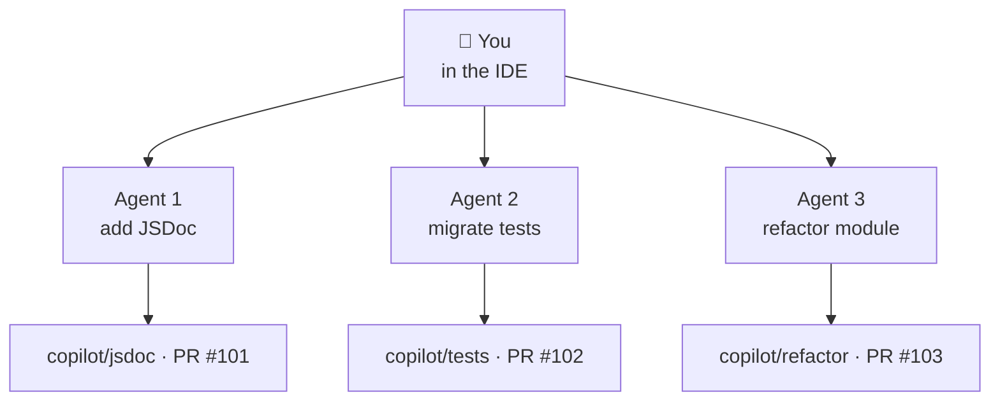

# Module 4

GitHub Copilot CLI — AI in your terminal

---
layout: default
---

# Why the CLI Complements the IDE

- IDE → tight feedback loop for interactive coding
- CLI → scriptable, headless, automatable
- Fits naturally into CI, git hooks, shell pipelines
- Lets you spin up **parallel** agents while you keep coding

<br>

Same engine, same context, different surface.

---
layout: default
---

# Already Installed?

You installed at the start of the day — `copilot --version` should work.

If you skipped the CLI path:

```bash
npm install -g @github/copilot
copilot           # first run prompts auth
```

Alt: `brew install copilot-cli` · `winget install GitHub.Copilot`

Same GitHub identity as the VS Code plugin. Sign in once, share the session.

---
layout: default
---

# Three Operating Modes

| Mode            | What it does                                 | Use when                           |
| --------------- | -------------------------------------------- | ---------------------------------- |
| **Interactive** | Default REPL — confirm each tool call        | Default, exploratory work          |
| **Plan**        | Read-only — proposes a plan, no edits        | Unfamiliar codebases, risky work   |
| **Autopilot**   | Executes autonomously with safety guardrails | Well-scoped tasks, repetitive work |

<br>

`Tab` cycles forward, `Shift+Tab` backward. You pick the mode, the mode picks the caution level.

(Bonus: `/fleet` is a _slash command_, not a mode — covered later.)

---
layout: default
---

# Plan Mode

```bash
copilot
> /plan
> Add JSDoc to every public method in task-helpers.ts
```

The agent:

1. Explores the file read-only
2. Proposes a plan you can edit
3. Waits for your approval (`Ctrl+Y`) before any change
4. Then executes step by step

<br>

The CLI equivalent of "Plan mode" in the IDE. Cheap insurance for anything non-trivial.

---
layout: default
---

# Autopilot Mode

```bash
copilot -p "fix the failing test in task-store.spec.ts"
```

The agent:

1. Reads the failing test
2. Edits files, runs tests, iterates
3. Stops when tests pass or it gets stuck
4. Hands control back to you for review

<br>

Risky commands (e.g. `rm`, `git reset --hard`) still need explicit approval.

---
layout: default
---

# Slash Commands in the REPL

```text
> /clear            # wipe context
> /compact          # summarise older turns
> /model haiku      # switch model
> /agent reviewer   # call a specialised agent
> /plan             # enter plan mode
> /delegate "task"  # background delegation
> /diff             # show pending changes
> /review           # run review skill on changes
```

Same mental model as Copilot Chat — typed instead of clicked.

---
layout: default
---

# Pro Workflow: Plan → Execute → Verify → Review

```text
1. Plan        (deep model: Opus / GPT-5)
   → Design the approach. Edit until tight.

2. Execute     (fast model: Sonnet / GPT-5 Mini)
   → Autopilot. Cheap, many short turns.

3. Verify      (MCP feedback loop)
   → Playwright runs E2E, ESLint runs lints,
     agent self-corrects on failures.

4. Review      (review skill / agent)
   → Deterministic PR check before commit.
```

Four phases, three model choices, one outcome.

---
layout: default
---

# Background Delegation — The Core Idea

Hand a long-running task to an agent that works in its own sandbox.

- The agent creates a branch (`copilot/...`)
- Opens a draft PR
- Iterates until done (or you stop it)
- Notifies you when ready

<br>

You stay in your IDE working on the **real** problem.

---
layout: default
---

# Parallelisation

<div style="display: flex; justify-content: center; margin-top: 8px;">



</div>

One developer, many simultaneous workstreams.

---
layout: default
---

# Delegate Lifecycle

```bash
# 1. Kick off
> /delegate "add JSDoc to every public method in
   src/app/features/tasks/util/task-helpers.ts"

# 2. Inspect progress
$ gh pr list --author copilot
$ gh pr view 101
$ gh pr diff 101

# 3. Iterate (push back, refine)
> /pr comment 101 "use @example blocks for non-trivial fns"

# 4. Merge — or close and re-delegate
```

Full git lifecycle. The agent's work shows up in your normal PR review process.

---
layout: default
---

# `/fleet` — Parallel Model Comparison

```text
> /fleet "implement the tags feature per the plan"
  → spawns 3 sub-agents on 3 branches
  → each uses a different model (Sonnet / Opus / GPT-5)
  → compare the diffs side-by-side
  → pick the winner, discard the rest
```

When you don't know which approach is right, let the agents argue.

Expensive — use for hard or contentious decisions.

---
layout: default
---

# MCP Feedback Loop in the CLI

```text
> /autopilot "fix every ESLint error in src/"

Agent: writes a fix → calls eslint MCP → still 2 errors
Agent: revises → calls eslint MCP → 0 errors
Agent: runs npm test → all green
Agent: done
```

The agent **self-corrects** by calling MCP tools as verifiers. No human in the loop until the final review.

---
layout: default
---

# Good vs Bad Delegation Candidates

**Good**

- Boring, well-defined tasks (JSDoc, renames, codemods)
- Bulk migrations (test framework, lint rules)
- Repetitive scaffolding (CRUD stores, controllers)
- "Add types everywhere" jobs

**Bad**

- Anything you can't review in 5 minutes
- Architectural decisions
- Security-critical changes
- "Make it better" — too vague to verify

---
layout: default
---

# Safety First

- Sandboxed file access (allow-list per session)
- `--allow-all` (alias `--yolo`) is convenient _and_ dangerous
- Review every diff before merging — every time
- Set a budget cap on background agents
- Never delegate: secret rotation, prod deploys, DB migrations
- Never run an agent over uncommitted work — commit or stash first

<br>

The CLI gives the agent a real shell. Treat that responsibility seriously.

---
layout: default
---

# Hooks — Deterministic Guardrails

Shell scripts the harness runs before/after every tool call. The model can't talk past them.

Use for: blocking risky commands, enforcing post-conditions, audit logging, self-healing loops.

Both **Claude Code** and **Copilot CLI** use the same hook syntax — Copilot reads `.claude/settings.json` as one of its config sources (alongside its own `.github/copilot/settings.json`).

---
layout: default
---

# Hook Config — Where It Lives

| Scope                 | Claude Code               | Copilot CLI                                                  |
| --------------------- | ------------------------- | ------------------------------------------------------------ |
| User                  | `~/.claude/settings.json` | `~/.copilot/settings.json`                                   |
| Repo                  | `.claude/settings.json`   | `.github/copilot/settings.json` _or_ `.claude/settings.json` |
| Personal hook scripts | `~/.claude/hooks/`        | `~/.copilot/hooks/`                                          |
| Repo hook scripts     | `.claude/hooks/`          | `.github/hooks/`                                             |

<br>

Supported events (both): `preToolUse`, `postToolUse`, `postToolUseFailure`, `userPromptSubmitted`, `sessionStart`, `sessionEnd`, `notification`, `preCompact`, `agentStop`.

---
layout: default
---

# Same Syntax, Both Tools

```jsonc
// .claude/settings.json — works for Claude Code AND Copilot CLI
{
  "hooks": {
    "PreToolUse": [
      {
        "matcher": "Bash|Edit|Write",
        "hooks": [
          {
            "type": "command",
            "command": ".claude/hooks/guard.sh",
          },
        ],
      },
    ],
  },
}
```

- Stdin = tool input JSON (incl. `tool_input`, `tool_name`)
- `exit 2` → blocks the call + shows stderr to the model
- `matcher` is a regex on tool name (fully matched, since v1.x)
- Copilot CLI also supports `HTTP` hooks (POST JSON to a URL) and `disableAllHooks`

---
layout: default
---

# When to Reach for the CLI

- "Fix every lint error" — script it, walk away
- "Migrate all 200 specs to the new harness" — `/delegate`
- CI pipeline that needs an AI review step — `copilot -p "review the diff"`
- Custom git hook (pre-commit, pre-push) — `copilot -p "scan staged diff for X"`
- A long refactor you'll babysit overnight — `/fleet`

<br>

The CLI shines when the task scales, the IDE shines when it doesn't.

---
layout: two-cols
---

# Copilot CLI

```bash
npm install -g @github/copilot
copilot
copilot -p "fix lint"
copilot --agent reviewer
```

- `@github/copilot` package
- GitHub auth
- Background agents via `/delegate`
- (Not the older `gh copilot` extension)

::right::

# Claude Code CLI

```bash
npm install -g @anthropic-ai/claude-code
claude
claude -p "fix lint"
claude --model haiku
```

- `@anthropic-ai/claude-code` package
- Anthropic auth
- Plan mode + Auto mode + Subagents

<br>

Same idea, two ecosystems.

---
layout: default
---

# 🛠 Hands-on 4 · Background Delegation · 15 min

## Hand off one tedious task, keep coding

> Prereq: `copilot --version` works. If not, see the previous slide.

1. Pick a boring, well-scoped task on the demo:
   - "Add JSDoc to every public method in `task-helpers.ts`"
   - "Convert `*.spec.ts` files to the new test harness"
2. Run it as a delegated background job (`/delegate` in the REPL)
3. Keep working on something else in your IDE — that's the point
4. Inspect progress: `gh pr list --author copilot` → `gh pr diff <n>`
5. Come back, review the diff, decide: merge, refine, or close + re-delegate

---
layout: default
zoom: 0.85
---

# 🛠 Hands-on 5 · Block Dangerous Calls · 15 min

## One hook config, both tools

Stop the agent from touching `.env`, `secrets/`, or `*.pem`. Same syntax for Claude Code and Copilot CLI — both read `.claude/settings.json`.

1. Create `.claude/hooks/block-secrets.sh`:

   ```bash
   #!/usr/bin/env bash
   # Stdin = tool input JSON. Block if path/args touch secrets.
   if jq -r '.tool_input | tostring' | grep -qE '\.env|secrets/|\.pem$'; then
     echo "❌ Blocked: tool touches secrets" >&2
     exit 2   # exit 2 = block + show stderr to the model
   fi
   ```

2. `chmod +x .claude/hooks/block-secrets.sh`
3. Wire it up in `.claude/settings.json` (next slide)
4. Ask the agent _"read `.env` and summarize"_ → hook blocks, model retries
5. **Verify:** the agent reports the block, doesn't silently succeed

---
layout: default
zoom: 0.85
---

# 🛠 5 · Hook Config

```jsonc
// .claude/settings.json
{
  "hooks": {
    "PreToolUse": [
      {
        "matcher": "Read|Edit|Write|Bash",
        "hooks": [
          {
            "type": "command",
            "command": ".claude/hooks/block-secrets.sh",
          },
        ],
      },
    ],
  },
}
```

- **Claude Code:** picks this up automatically
- **Copilot CLI:** also reads `.claude/settings.json` as repo config — same file works
- Prefer Copilot's own path? Put the same JSON in `.github/copilot/settings.json`

**Layered defense (optional):** define a `safe-editor` agent with `tools: [view, edit, grep]` (no `bash`) so the model can't even request shell access.

---
layout: default
zoom: 0.85
---

# 🛠 Bonus · Self-Healing Lint Loop

Auto-lint after every edit. The agent sees the error in its next turn and self-corrects — both tools, same hook:

```jsonc
// .claude/settings.json
{
  "hooks": {
    "PostToolUse": [
      {
        "matcher": "Edit|Write",
        "hooks": [
          {
            "type": "command",
            "command": ".claude/hooks/lint.sh",
          },
        ],
      },
    ],
  },
}
```

The script:

```bash
#!/usr/bin/env bash
npm run lint --silent || { echo "❌ Lint failed" >&2; exit 2; }
```

> Scope to changed files on slow projects (`eslint <file>`), not whole repo.

---
layout: default
---

# 🛠 Bonus Tracks · Pick One · 10–15 min

Two optional deep-dives if you have time left.

- **A · /fleet Wettkampf** — let three models compete on the same task
- **B · CI Integration** — wire Copilot CLI into a GitHub Actions step

---
layout: default
zoom: 0.9
---

# 🛠 Bonus A · /fleet Wettkampf · 15 min

## Three models, one task, side-by-side diffs

1. Pick a small, opinionated task (e.g. _"refactor `task-store.ts` to extract a CRUD helper"_)
2. Run it via fleet across three models:

   ```text
   > /fleet "refactor task-store.ts to extract a CRUD helper"
     → spawns 3 branches, one per model
   ```

3. Compare the three PRs: `gh pr diff <n>` for each
4. Pick a winner. Note **why** — naming? structure? tests?
5. Close the losers. That's the workflow.

<br>

Use sparingly — fleet is 3× the cost. Worth it for contentious decisions.

---
layout: default
zoom: 0.85
---

# 🛠 Bonus B · CI Integration · 10 min

## Run Copilot CLI as a GitHub Actions step

1. Add `.github/workflows/ai-review.yml`:

   ```yaml
   on: pull_request
   jobs:
     ai-review:
       runs-on: ubuntu-latest
       steps:
         - uses: actions/checkout@v4
         - run: npm install -g @github/copilot
         - run: copilot -p "review the diff for accessibility issues, comment inline"
           env:
             GH_TOKEN: ${{ secrets.GITHUB_TOKEN }}
   ```

2. Open a PR with a small UI change
3. Watch the action run — Copilot posts review comments
4. Iterate on the prompt until the noise/signal ratio is right
5. **Bonus:** gate merging on Copilot's review passing
