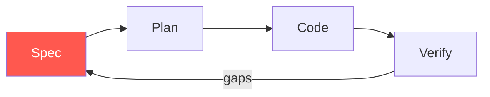

# Module 5

Where this is going

---
layout: default
---

# Spec-Driven Development

- The spec is the **primary artefact**, not the code
- Code is generated from the spec, regenerated when the spec changes
- The team's review effort shifts to the spec
- Closes the loop: ambiguity disappears upstream

---
layout: default
---

# The SDD Loop

The spec evolves with the system.

---
layout: default
---

# Tools to Watch

- **GitHub Spec Kit** — spec → plan → tasks → code workflow
- **OpenSpec** — open standard, tool-agnostic
- **Kiro** — IDE built around specs first
- All early. All worth watching.

---
layout: default
---

# From Developer → Product Developer

- You spend less time typing, more time deciding
- Your taste — naming, structure, UX — matters more, not less
- You ship features, not lines of code
- The job title may not change. The work will.

---
layout: two-cols
---

# What changes

- Typing speed → irrelevant
- Memorising APIs → optional
- Doing the same thing twice → wasteful

::right::

# What stays the same

- Reading code carefully
- Understanding the domain
- Owning the outcome
- Asking the hard "why" question

---
layout: default
---

# Skills to Invest In Next

- **Specs & writing** — clear thinking, clear prose
- **Code review** — your bottleneck moves here
- **System design** — agents need an architecture
- **Evals** — measure what your AI workflows actually deliver

---
layout: default
---

# Resources

- `github.github.com/spec-kit` — Spec Kit docs
- `openspec.dev` — OpenSpec standard
- `modelcontextprotocol.io` — MCP spec
- `docs.anthropic.com/claude-code` — Claude Code
- `docs.github.com/copilot` — GitHub Copilot

---
layout: default
---

# Q & A

- What surprised you today?
- What will you try tomorrow?
- What is still unclear?
