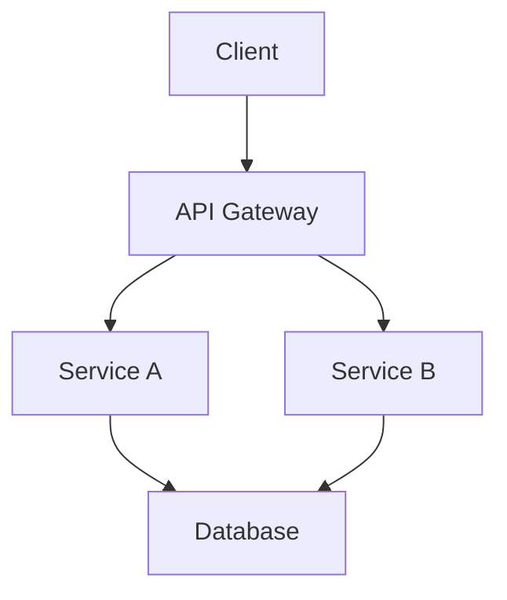

# Headline 1-zeilig

::subtitle::

Subheadline

---
layout: cover
speaker: Vorname Name
handle: vornamename
role: Senior Consultant
---

# Headline

# 2-zeilig

::subtitle::

Subheadline

---
layout: cover-light
speaker: Vorname Name
handle: vornamename
role: Consultant
---

# Headline 1-zeilig

::subtitle::

Subheadline

---
layout: default
---

# Slide Titel

## Subheadline

- Erster Punkt mit wichtigen Informationen
- Zweiter Punkt mit Details
- Dritter Punkt als Zusammenfassung
  - Unterpunkt mit Erklärung
  - Weiterer Unterpunkt

---
layout: default
---

# Code Beispiel

## TypeScript

```ts
import { Component, signal } from '@angular/core'

@Component({
  selector: 'app-root',
  template: `<h1>{{ title() }}</h1>`,
})
export class AppComponent {
  title = signal('Hello Thinktecture!')
}
```

---
layout: two-cols
---

# Linke Spalte

- Punkt eins
- Punkt zwei
- Punkt drei

::right::

# Rechte Spalte

- Detail A
- Detail B
- Detail C

---
layout: visual
---

# Architektur

## Systemübersicht

Die Architektur basiert auf einem modularen Ansatz mit klarer Trennung der Zuständigkeiten.

::visual::



---
layout: default
---

# TT Icons

## Neue SVG-Icons (über CSS `mask-image` eingefärbt)

<div style="display: flex; gap: 32px; flex-wrap: wrap; margin-top: 16px;">
  <div style="text-align: center;">
    <TtIcon name="ai-agent" color="red" size="64px" />
    <div style="font-size: 0.75rem; margin-top: 4px;">ai-agent (red)</div>
  </div>
  <div style="text-align: center;">
    <TtIcon name="llm-language-model" color="black" size="64px" />
    <div style="font-size: 0.75rem; margin-top: 4px;">llm-language-model (black)</div>
  </div>
  <div style="text-align: center;">
    <TtIcon name="vector-database" color="gray" size="64px" />
    <div style="font-size: 0.75rem; margin-top: 4px;">vector-database (gray)</div>
  </div>
  <div style="text-align: center;">
    <TtIcon name="rag-retrieval-augmented-generation" color="blue" size="64px" />
    <div style="font-size: 0.75rem; margin-top: 4px;">rag (blue)</div>
  </div>
  <div style="text-align: center;">
    <TtIcon name="tool-use-function-calling" color="red" size="64px" />
    <div style="font-size: 0.75rem; margin-top: 4px;">tool-use (red)</div>
  </div>
  <div style="text-align: center;">
    <TtIcon name="prompt-template" color="black" size="64px" />
    <div style="font-size: 0.75rem; margin-top: 4px;">prompt-template (black)</div>
  </div>
  <div style="text-align: center;">
    <TtIcon name="chain-of-thought" color="red" size="64px" />
    <div style="font-size: 0.75rem; margin-top: 4px;">chain-of-thought (red)</div>
  </div>
  <div style="text-align: center;">
    <TtIcon name="knowledge-base" color="blue" size="64px" />
    <div style="font-size: 0.75rem; margin-top: 4px;">knowledge-base (blue)</div>
  </div>
</div>

## Klassische PNG-Icons (4 Farbvarianten)

<div style="display: flex; gap: 32px; flex-wrap: wrap; margin-top: 16px;">
  <div style="text-align: center;">
    <TtIcon name="cloud" color="red" size="64px" />
    <div style="font-size: 0.75rem; margin-top: 4px;">cloud (red)</div>
  </div>
  <div style="text-align: center;">
    <TtIcon name="server" color="black" size="64px" />
    <div style="font-size: 0.75rem; margin-top: 4px;">server (black)</div>
  </div>
  <div style="text-align: center;">
    <TtIcon name="datenbank" color="gray" size="64px" />
    <div style="font-size: 0.75rem; margin-top: 4px;">datenbank (gray)</div>
  </div>
  <div style="text-align: center;">
    <TtIcon name="key" color="blue" size="64px" />
    <div style="font-size: 0.75rem; margin-top: 4px;">key (blue)</div>
  </div>
  <div style="text-align: center;">
    <TtIcon name="gears" color="red" size="64px" />
    <div style="font-size: 0.75rem; margin-top: 4px;">gears (red)</div>
  </div>
  <div style="text-align: center;">
    <TtIcon name="notebook" color="black" size="64px" />
    <div style="font-size: 0.75rem; margin-top: 4px;">notebook (black)</div>
  </div>
  <div style="text-align: center;">
    <TtIcon name="user" color="red" size="64px" />
    <div style="font-size: 0.75rem; margin-top: 4px;">user (red)</div>
  </div>
  <div style="text-align: center;">
    <TtIcon name="globus" color="blue" size="64px" />
    <div style="font-size: 0.75rem; margin-top: 4px;">globus (blue)</div>
  </div>
</div>

---
layout: section
---

# Nächster Abschnitt

Überleitung zum nächsten Thema

---
layout: blank
---

<div style="display: flex; align-items: center; justify-content: center; height: 100%; font-size: 3rem; font-weight: 600; color: var(--tt-red);">
  Freier Inhalt
</div>

---
layout: end
website: thinktecture.com
email: info@thinktecture.com
---

# Vielen Dank!

Fragen?
